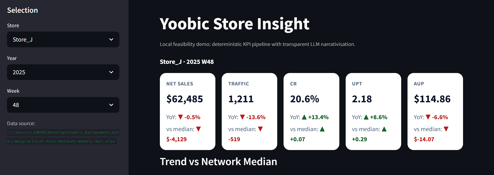
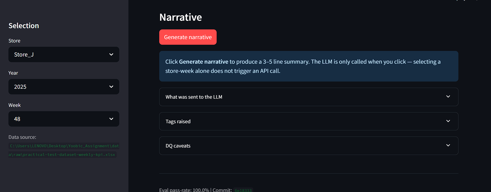
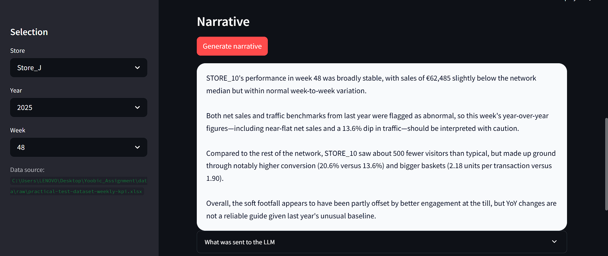
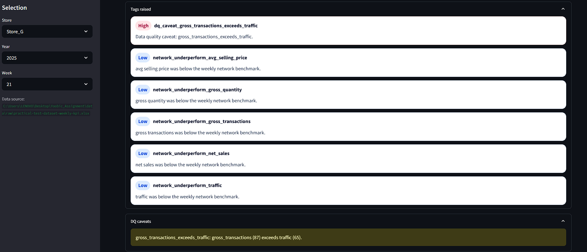
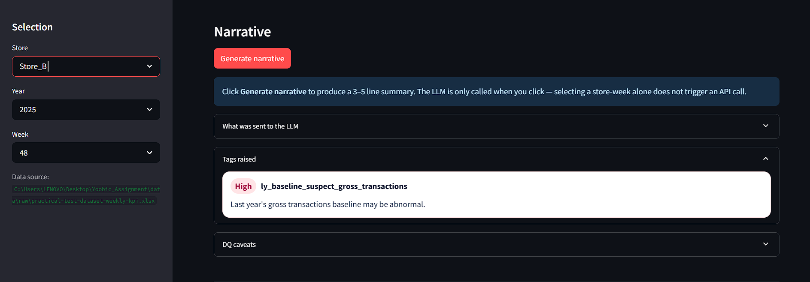
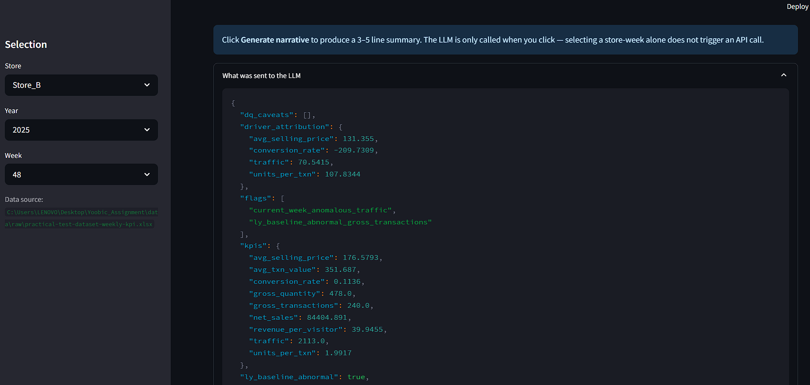

# Yoobic Store Insight

A feasibility prototype that turns weekly store KPI data into a transparent, store-manager-ready narrative — built as an AI Technical PM assignment.

---



---

## What it does

A store manager selects their store and week. The app shows KPI cards (net sales, traffic, CR, UPT, avg unit price) with YoY deltas and a gap-to-network-median indicator, a 12-week trend chart vs the network, and a 3–5 line LLM-generated narrative that calls out unusual values, flags suspect YoY baselines, and suggests likely root causes from the store-vs-network signals.

---

## How it works

**Deterministic layer first.** All KPI derivation, anomaly detection, YoY logic, network-gap computation, and feature tagging happen in a pure-Python pipeline before any LLM step. The LLM only receives a structured payload and narrates it.

- Every number in the narrative traces to a specific formula on the source data
- Anomaly flags and DQ caveats are rule-based — the LLM does not decide what is unusual
- Full rule-based fallback narrative if no API key is present
- Numeric-grounding checks in the eval harness verify factual accuracy independently of prompt quality

**LLM layer on-demand.** The LLM is called only when the user clicks **Generate narrative**. Selecting a store-week alone triggers no API call.

---

## Demo

### Narrative generation

Click **Generate narrative** to invoke the LLM. The app will not call the API on store-week selection — this is deliberate to keep costs and latency user-controlled.





---

### Edge cases & robustness

**Data-quality caveat — Store_G W21.** This store-week has `gross_transactions > traffic` (CR ≈ 134%). The app surfaces an explicit caveat in the narrative rather than silently narrating an impossible number.



**Abnormal LY baseline.** When last year's same-week value was itself anomalous, the narrative flags it so the YoY comparison is not taken at face value.



---

### Transparency panel

One click exposes the full structured payload, deterministic tags, and any caveats raised by the pipeline — nothing opaque reaches the LLM.



---

## How to run

The app runs locally against `data/raw/practical-test-dataset-weekly-kpi.xlsx` (gitignored — add your own copy).

```bash
python -m venv .venv
source .venv/bin/activate
pip install -r requirements.txt
pip install -e .
cp .env.example .env
```

Minimum `.env`:

```
OPENAI_API_KEY=sk-...
OPENAI_MODEL=gpt-4o-mini
JUDGE_MODEL=gpt-4o
YOOBIC_DATA_PATH=data/raw/practical-test-dataset-weekly-kpi.xlsx
```

If `OPENAI_API_KEY` is blank the app falls back to the deterministic narrative automatically.

```bash
streamlit run app/streamlit_app.py
```

---

## Evaluation

```bash
python -m pytest -q                          # deterministic pipeline tests
python -m yoobic_insight.eval                # fallback path, no API key needed
python -m yoobic_insight.eval --require-llm  # force LLM path
```

Current deterministic pass rate: **100%** (see [eval/reports/eval_v1.md](eval/reports/eval_v1.md)).

---

## Limitations & next steps

| Area | V1 | Next |
|---|---|---|
| Data source | Single local xlsx | Controlled ingestion from approved sources |
| Narrative | Deterministic fallback + optional LLM | Prompt versioning, broader scenario coverage |
| Privacy | Aliases at LLM boundary; raw file stays local | Formal privacy review, stricter data contracts |
| UI | Streamlit demo | Production UX, role-based views, export flows |
| Evaluation | Deterministic golden scenarios | Larger suite, human review loop, regression dashboard |
| Operations | Manual local run | ML Engineering ownership, managed deployment |

---

## Privacy

Store names are aliased at the LLM boundary (`STORE_01`, `STORE_02`, …) — raw names never cross the API call. Raw KPI files under `data/raw/` are gitignored and must stay local. See [docs/privacy_note.md](docs/privacy_note.md).

---

## Supporting docs

- [docs/eda_summary.md](docs/eda_summary.md) — findings from exploratory analysis
- [docs/prd.md](docs/prd.md) — product requirements and scope decisions
- [docs/handoff_brief.md](docs/handoff_brief.md) — ML Engineering handoff notes
- [docs/privacy_note.md](docs/privacy_note.md) — privacy handling details
- [eval/reports/eval_v1.md](eval/reports/eval_v1.md) — evaluation report
